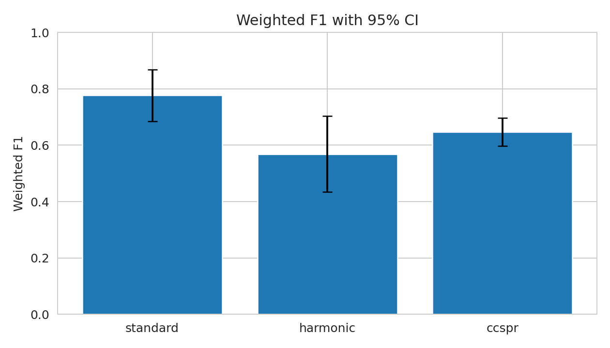
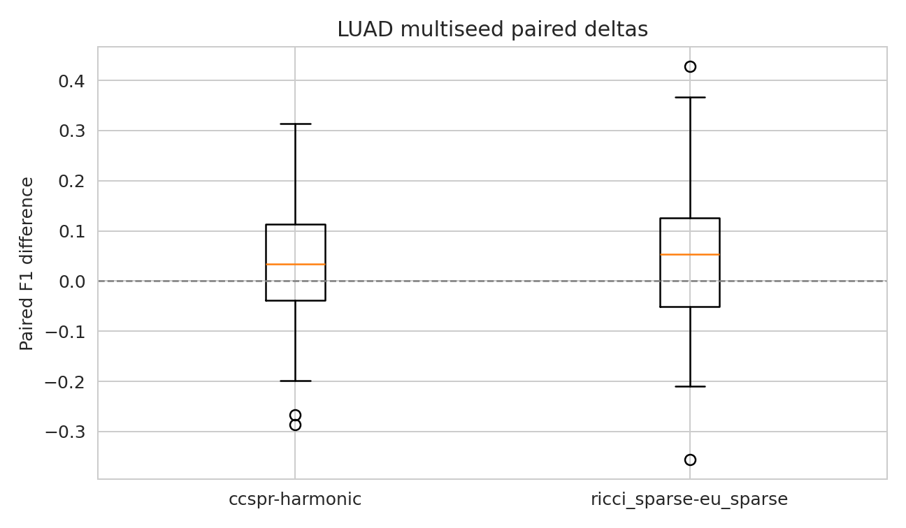
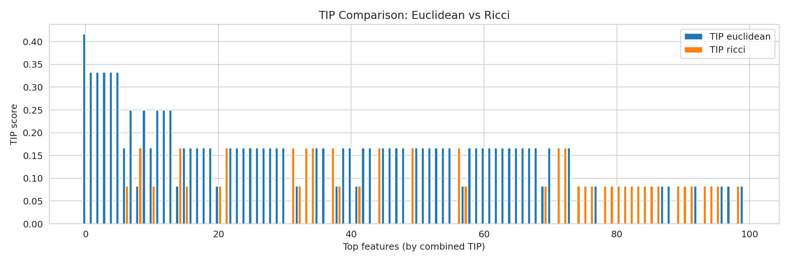
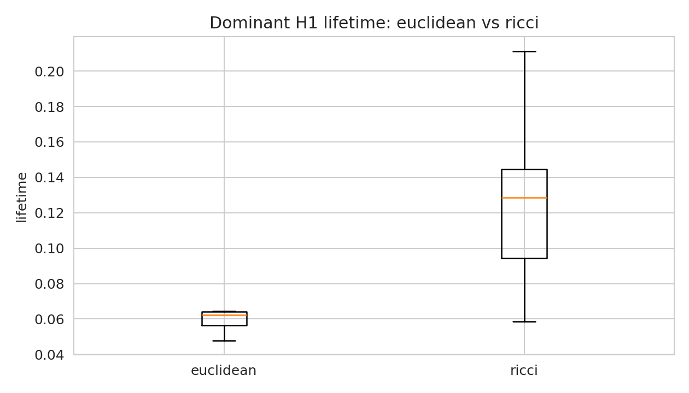
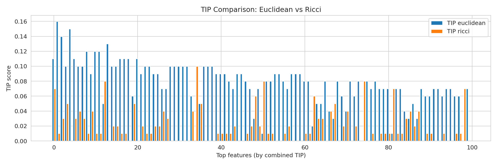
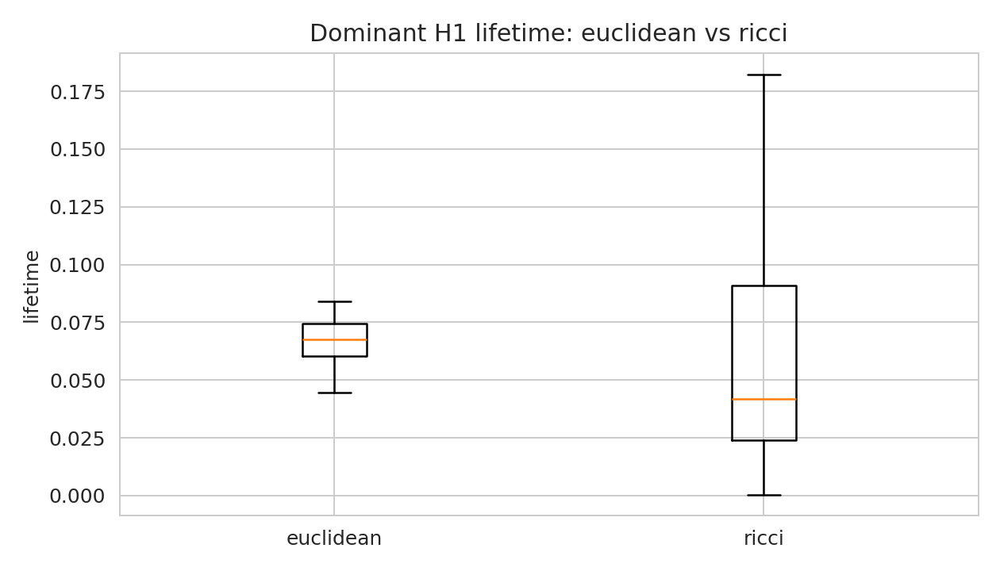
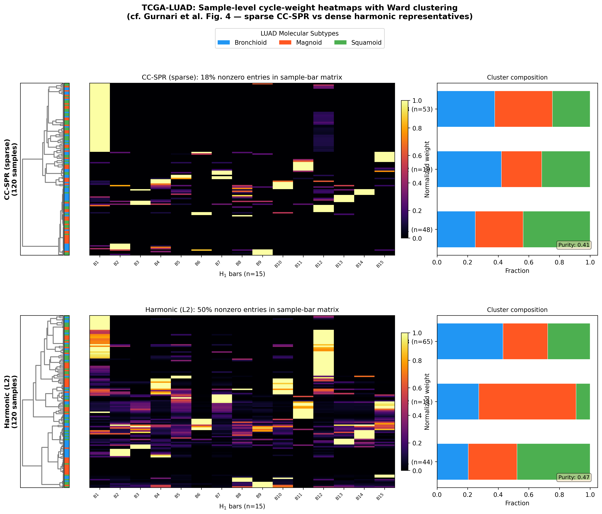
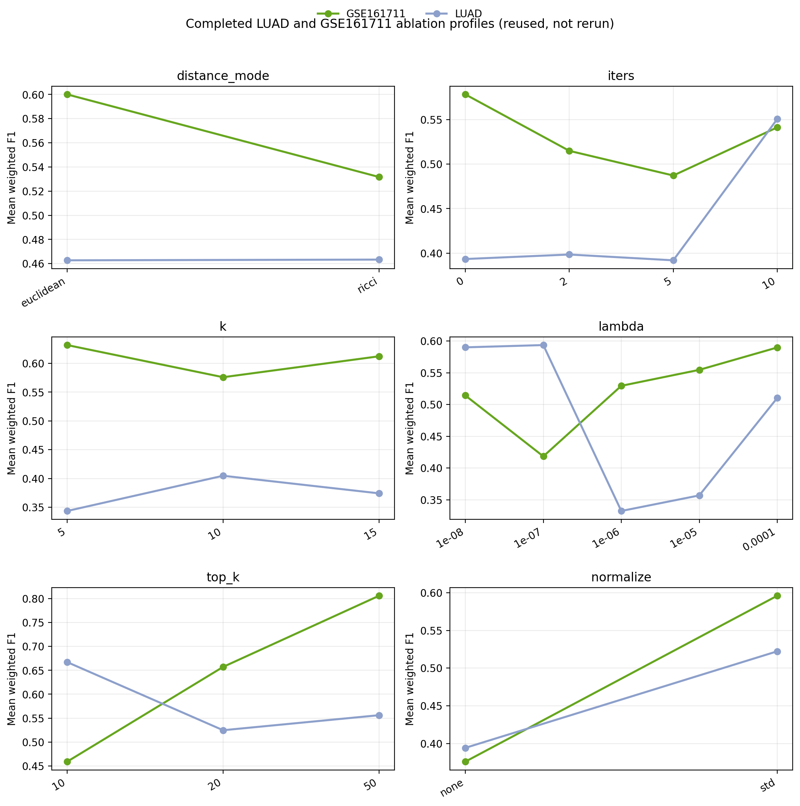

*Keywords:* topological data analysis, persistent homology, omics
feature selection, geometry-aware, sparse optimization

* Introduction
  :PROPERTIES:
  :CUSTOM_ID: sec:introduction
  :END:

** Biological motivation
   :PROPERTIES:
   :CUSTOM_ID: biological-motivation
   :END:

Modern omics experiments---bulk RNA-seq, single-cell transcriptomics,
methylation arrays, proteomics---routinely produce data matrices with
$n$ samples in $10^1$--$10^5$ and $p$ features in $10^3$--$10^5$. These
matrices encode geometry that reflects biological structure: tumor
subtypes form clusters; differentiation trajectories trace manifold-like
paths; regulatory circuits create loop-like patterns in expression
space; and microenvironment heterogeneity introduces curvature and
density variation. This geometric richness makes omics a natural setting
for topological data analysis (TDA)
\cite{carlsson2009, edelsbrunner2010}, which has been applied to gene
expression landscapes \cite{rizvi2017}, protein structure
\cite{xia2014}, tumor microenvironments \cite{vipond2021}, single-cell
trajectories \cite{moon2019phate}, neural population coding
\cite{giusti2015}, and viral evolution \cite{chan2013topology}.

Persistent homology, the workhorse of TDA, captures collective
structure---loops, voids, connected components---that cannot be detected
by feature-wise statistics or pairwise correlations alone. However, the
standard pipeline has a well-known interpretability gap: while a barcode
tells us /that/ a topological feature exists and /how long/ it persists,
it does not tell us /which samples/ participate in the corresponding
cycle, nor /which molecular features/ drive it.

** The harmonic PH advance and its limitations
   :PROPERTIES:
   :CUSTOM_ID: the-harmonic-ph-advance-and-its-limitations
   :END:

Harmonic persistent homology \cite{harmonicPH} addresses this gap by
computing a representative cycle for each persistent class that
minimizes an $\ell_2$ (harmonic) energy, creating a bridge from
topological features back to individual samples and molecular features.
However, two practical limitations motivate the present work:

1. *Dense representatives blur interpretation.* The harmonic $\ell_2$
   objective spreads weight broadly across edge support. In omics, where
   the goal is to identify compact gene sets associated with topological
   signals, dense support complicates downstream pathway analysis.

2. *Euclidean geometry may be inappropriate.* The default sample-space
   metric is Euclidean distance, which is often too rigid for biological
   data with nonuniform density, curvature-rich manifold structure, or
   developmental trajectories. Different metrics can produce different
   filtrations and different representatives---a sensitivity that should
   be modeled explicitly.

** Contributions
   :PROPERTIES:
   :CUSTOM_ID: contributions
   :END:

We introduce *CC-SPR* (Cycle-Consistent Sparse Persistent
Representatives), which addresses both limitations within the harmonic
persistent homology scaffold:

1. *Sparse elastic representatives.* We replace the dense $\ell_2$
   objective with a convex elastic-net objective that concentrates cycle
   support on a small number of edges, yielding interpretable,
   bootstrap-stable feature-importance profiles.

2. *Backend-aware geometry.* We formalize the sample-space metric as a
   selectable backend, implementing Euclidean, Ollivier--Ricci,
   diffusion, PHATE-like, and distance-to-measure (DTM) geometry
   families.

3. *Topological influence profiles (TIP).* We introduce a
   bootstrap-aggregated feature-stability diagnostic that enables direct
   comparison of support concentration across geometries.

4. *Cross-domain evaluation.* We benchmark all five backends on three
   cancer-genomics datasets and provide targeted cross-domain evidence
   on plant transcriptomics.

CC-SPR is not a claim of predictive superiority over standard
classifiers. It is a framework that makes topology-derived features more
interpretable and geometry-aware; every harmonic PH analysis is a
special case with $\lambda_1 = 0$ and a Euclidean backend.

* Materials and Methods
  :PROPERTIES:
  :CUSTOM_ID: sec:methods
  :END:

** Datasets
   :PROPERTIES:
   :CUSTOM_ID: sec:datasets
   :END:

We use four datasets with distinct evaluation roles
(Table [[#tab:datasets][[tab:datasets]]]):

- *TCGA-LUAD* (lung adenocarcinoma, $p \approx 20{,}000$): main
  benchmark anchor. Evaluated at two scales: pilot ($n = 60$, 2-split
  CV, $n_{\text{boot}} = 5$) and full cohort ($n = 275$, 5-fold CV,
  $n_{\text{boot}} = 5$, 2000 variable genes).

- *GSE161711* (CLL/venetoclax bulk RNA-seq, $n = 96$): disease-aligned
  bulk validation with 5-fold CV.

- *GSE165087* (CLL/RS-like scRNA-seq, bounded $n = 320$): bounded
  single-cell feasibility test with all five backends.

- *Arabidopsis root atlas* (GSE123013 \cite{denyer2019}, scRNA-seq,
  $n = 500$, 16 Leiden clusters): targeted cross-domain generalization
  test with Euclidean and DTM only.

| Dataset             | Type           | $n$   | $p$      | Labels                      |
|---------------------+----------------+-------+----------+-----------------------------|
| TCGA-LUAD (pilot)   | Bulk RNA-seq   | 60    | 20,530   | Molecular subtype           |
| TCGA-LUAD (full)    | Bulk RNA-seq   | 275   | 20,530   | Molecular subtype           |
| GSE161711           | Bulk RNA-seq   | 96    | 17,860   | Venetoclax response         |
| GSE165087           | scRNA-seq      | 320   | 5,000    | CLL vs Richter              |
| Arabidopsis root    | scRNA-seq      | 500   | 21,965   | Leiden cluster (16 types)   |
#+CAPTION: Datasets used in this study. GSE161711 and GSE165087 are
public GEO substitutes for originally intended controlled-access
datasets.

** The CC-SPR framework
   :PROPERTIES:
   :CUSTOM_ID: sec:ccspr_framework
   :END:

CC-SPR preserves the four-step harmonic persistent homology
scaffold---construct a sample-space metric, compute a filtration and
persistent homology, choose a representative cycle, project to feature
space---but modifies two steps: the representative objective (Step 3)
and the metric (Step 1).

**** Notation.
     :PROPERTIES:
     :CUSTOM_ID: notation.
     :END:

Let $X \in \mathbb{R}^{n \times p}$ denote an omics data matrix. A
/geometry backend/ $\mathcal{G}$ with hyperparameters
$\theta_{\mathcal{G}}$ induces a symmetric distance matrix
$D^{(\mathcal{G})} \in \mathbb{R}_{\ge 0}^{n \times n}$. The
Vietoris--Rips filtration on $D^{(\mathcal{G})}$ produces a nested
sequence of simplicial complexes whose homology yields a persistence
barcode $\{[b_i, d_i)\}$ \cite{zomorodian2005, edelsbrunner2010}. We
focus on $H_1$ bars because 1-cycles in sample space project to feature
space via the data matrix, creating a bridge from topological structure
to gene-level influence.

**** Harmonic (dense) objective.
     :PROPERTIES:
     :CUSTOM_ID: harmonic-dense-objective.
     :END:

For a selected $H_1$ bar $[b, d)$ with initial cycle $z_0 \in C_1$ and
boundary operator $\partial_2$, the harmonic representative minimizes
$$\label{eq:harmonic}
\hat{y}_{\mathrm{harm}} = \argmin_{y \in C_2} \| z_0 + \partial_2 y \|_2^2.$$
This produces the smoothest cycle, typically with dense edge support
($\|z\|_0 = O(|E|)$), which dilutes biological signal when projected to
feature space \cite{harmonicPH, friedman1998}.

**** Sparse elastic objective.
     :PROPERTIES:
     :CUSTOM_ID: sparse-elastic-objective.
     :END:

CC-SPR replaces ([[#eq:harmonic][[eq:harmonic]]]) with an elastic-net
formulation: $$\label{eq:ccspr}
\hat{y}_{\mathrm{spr}} = \argmin_{y \in C_2} \;\underbrace{\| z_0 + \partial_2 y \|_2^2}_{\text{fidelity}} + \underbrace{\lambda_1 \| z_0 + \partial_2 y \|_1}_{\text{sparsity}} + \underbrace{\lambda_2 \| y \|_2^2}_{\text{stability}},$$
with $\lambda_1, \lambda_2 \ge 0$. The objective is convex (strongly
convex when $\lambda_2 > 0$), and the $\ell_1$ penalty drives small edge
weights to zero, producing representatives with compact support (see
Supplementary Section S2 for proofs of convexity and sparsity
guarantees). The structure mirrors the elastic net
\cite{zou2005elasticnet}: $\lambda_1$ plays the LASSO role promoting
sparsity, $\lambda_2$ provides ridge-like stability, and the "design
matrix" is the boundary operator $\partial_2$.

** Topological influence profiles (TIP)
   :PROPERTIES:
   :CUSTOM_ID: sec:tip
   :END:

For bootstrap replicates $b = 1, \ldots, B$ and a top-$K$ feature
selection threshold, let $S_b$ denote the set of features with the $K$
largest absolute projected weights from the sparse representative in
replicate $b$. The /topological influence profile/ is
$$\TIP(j) = \frac{1}{B} \sum_{b=1}^B \mathbf{1}\{j \in S_b\}, \qquad j = 1, \ldots, p.$$
Concentrated TIP mass (a few features with $\TIP(j) \approx 1$)
indicates stable topological signal; diffuse mass indicates unstable
support. Because TIP applies identically to any geometry backend, it
provides a natural diagnostic for comparing how backends affect
interpretability.

** Geometry backends
   :PROPERTIES:
   :CUSTOM_ID: sec:backends
   :END:

A central design principle of CC-SPR is that the sample-space metric is
a selectable parameter, not a fixed assumption. Backend choice can be
understood as a controlled perturbation: when the distance matrices from
two backends differ by $\varepsilon_\infty$ in the $\ell_\infty$ norm,
the bottleneck distance between persistence diagrams is bounded by
$\varepsilon_\infty$ \cite{chazal2014persistence}. We implement five
backends:

**** Euclidean (baseline).
     :PROPERTIES:
     :CUSTOM_ID: euclidean-baseline.
     :END:

Standard $\ell_2$ distance in PCA space:
$D^{(\text{eu})}_{ij} = \|x_i - x_j\|_2$. Simple and efficient, but
rigid---it treats all directions equally and does not adapt to local
density or curvature.

**** Ollivier--Ricci curvature.
     :PROPERTIES:
     :CUSTOM_ID: ollivierricci-curvature.
     :END:

The Ollivier--Ricci curvature \cite{ollivier2007,ollivier2009} of an
edge $(u,v)$ is $\kappa(u,v) = 1 - W_1(\mu_u, \mu_v)/d(u,v)$, where
$W_1$ is the Wasserstein-1 distance between neighborhood measures.
Discrete Ricci flow \cite{ni2019community} iteratively updates edge
weights:
$w_{uv}^{(t+1)} = w_{uv}^{(t)} - \eta \cdot \kappa^{(t)}(u,v) \cdot w_{uv}^{(t)}$,
upweighting negatively curved (bridge) edges. This delays merger of
distinct components in the filtration, potentially preserving genuine
cycles at the expense of noise-induced shortcuts.

**** Diffusion.
     :PROPERTIES:
     :CUSTOM_ID: diffusion.
     :END:

Diffusion distances \cite{coifman2006diffusion} are derived from the
eigendecomposition of a Markov transition matrix $P = D_W^{-1}W$,
capturing connectivity that persists across random walks of varying
length. A time parameter $t$ controls scale: small $t$ recovers local
geometry; large $t$ emphasizes global connectivity. Implemented via
truncated eigendecomposition (50 eigenvectors).

**** PHATE-like.
     :PROPERTIES:
     :CUSTOM_ID: phate-like.
     :END:

PHATE \cite{moon2019phate} transforms diffusion operators via a log
potential: $U_i = -\log(P^t_{i,\cdot} + \epsilon)$, with potential
distance $D^{(\text{phate})}(i,j) = \|U_i - U_j\|_2$. This measures how
differently random walks from $i$ and $j$ explore the graph,
approximating a Fisher--Rao-like distance. Our implementation uses a
lightweight potential-distance computation without the full MDS step.

**** Distance-to-measure (DTM).
     :PROPERTIES:
     :CUSTOM_ID: distance-to-measure-dtm.
     :END:

DTM \cite{chazal2011dtm, chazal2017robust} replaces pairwise distances
with density-smoothed variants:
$d_{\mu_X, m_0}(x) = (\frac{1}{\lceil m_0 n \rceil} \sum_{j=1}^{\lceil m_0 n \rceil} \|x - x_{(j)}\|^2)^{1/2}$.
DTM-weighted distances delay inclusion of outlier-adjacent simplices,
suppressing topological noise from density spikes---relevant for omics
data with batch effects, dropout, or technical outliers.

** Evaluation protocol
   :PROPERTIES:
   :CUSTOM_ID: sec:evaluation
   :END:

All five backends are evaluated under the same pipeline: backend $\to$
Rips filtration $\to$ persistent homology $\to$ sparse representative
$\to$ TIP $\to$ feature selection $\to$ weighted-F1 classification
(logistic regression). Dataset-appropriate replication:

- LUAD pilot: 2-split CV, $n_{\text{boot}} = 5$; all five backends.

- LUAD full: 5-fold CV, $n_{\text{boot}} = 5$, 2000 variable genes; all
  five backends.

- GSE161711: 5-fold CV, $n_{\text{boot}} = 5$; all five backends.

- GSE165087: 1 split, $n_{\text{boot}} = 1$; all five backends.

- Arabidopsis: 3-fold CV, $n_{\text{boot}} = 3$; Euclidean and DTM only.

**** Leakage control.
     :PROPERTIES:
     :CUSTOM_ID: leakage-control.
     :END:

Within each training fold: (1) variable genes are selected by variance
on training data only; (2) standardization uses training-derived
parameters; (3) bootstrap TIP computation uses training-fold subsamples
only; (4) feature selection and classifier training operate exclusively
on training data. Two departures from a fully strict within-fold
protocol: global PCA where applied (single-cell data), and full-dataset
variable-gene selection in the standard baseline only at full LUAD
scale. Both are documented and apply identically across all methods.

**** Resource policy.
     :PROPERTIES:
     :CUSTOM_ID: resource-policy.
     :END:

Experiments were conducted in two phases: Phase 1 on an HPC cluster
(48 GB, 8 CPUs; pilot LUAD, GSE161711, GSE165087) and Phase 2 on a local
workstation (Intel i9-9920X, 24 threads, 125 GB RAM; full-scale LUAD and
Arabidopsis). Rather than silently omitting failed runs, completed
outputs are reused and resource limits are stated explicitly.

** Pipeline algorithm
   :PROPERTIES:
   :CUSTOM_ID: sec:algorithm
   :END:

Data matrix $X \in \mathbb{R}^{n \times p}$, geometry backend
$\mathcal{G}$, parameters $\lambda_1, \lambda_2, k, K$, bootstraps $B$
Topological influence profile $\TIP \in [0,1]^p$ Compute distance matrix
$D^{(\mathcal{G})} \gets \texttt{Backend}(X, \mathcal{G})$ Compute
Vietoris--Rips filtration and persistent homology on $D^{(\mathcal{G})}$
Select the most persistent $H_1$ bar $[b, d)$ Extract initial cycle
$z_0$ and boundary operator $\partial_2$ at scale
$\varepsilon = (b + d)/2$ Draw bootstrap resample $X^{(b)}$ of size $n$
Recompute $D^{(\mathcal{G})(b)}$, filtration, and persistent homology
Solve [[#eq:ccspr][[eq:ccspr]]] to obtain $\hat{z}_{\mathrm{spr}}^{(b)}$
Project $\hat{z}_{\mathrm{spr}}^{(b)}$ to feature space:
$w^{(b)} \in \mathbb{R}^p$ Select top-$K$ features:
$S_b \gets \{j : |w^{(b)}_j| \text{ among top-}K\}$ Compute
$\TIP(j) \gets \frac{1}{B} \sum_{b=1}^B \mathbf{1}\{j \in S_b\}$ for
each feature $j$ $\TIP$

**** Computational complexity.
     :PROPERTIES:
     :CUSTOM_ID: computational-complexity.
     :END:

The dominant costs are distance matrix computation ($O(n^2 p)$ for
Euclidean; higher for Ricci flow and diffusion eigendecomposition),
persistent homology ($O(m^3)$ worst case, much faster in practice
\cite{gudhi2014}), and sparse optimization ($O(|E|^2 \cdot |F|)$ per
bootstrap). Total cost is $O(B \cdot (n^2 p + m^3))$, dominated by the
bootstrap loop. Full-scale LUAD ($n = 275$) requires 35 minutes to 2.5
hours per backend; the CVXPY elastic-net solver on the boundary matrix
is the computational bottleneck.

** Comparison with harmonic PH
   :PROPERTIES:
   :CUSTOM_ID: sec:comparison
   :END:

Table [[#tab:hphcompare][[tab:hphcompare]]] provides a systematic
comparison of harmonic PH and CC-SPR.

| *Axis*                     | *Harmonic PH*               | *CC-SPR*                                  |
|----------------------------+-----------------------------+-------------------------------------------|
| Metric assumption          | Fixed Euclidean             | Selectable backend family                 |
| Representative criterion   | Dense $\ell_2$ (harmonic)   | Sparse elastic net                        |
| Sparsity                   | No explicit control         | $\lambda_1$-controlled                    |
| Interpretability           | Diffuse feature weights     | Concentrated feature weights              |
| Stability diagnostics      | Not built-in                | TIP profiles (bootstrap)                  |
| Computational cost         | Moderate                    | Moderate to high (backend-dependent)      |
| Backend flexibility        | None (single metric)        | Euclidean, Ricci, diffusion, PHATE, DTM   |
| Biological alignment       | Medium (diluted signal)     | High (compact gene sets)                  |
#+CAPTION: Comparison of harmonic PH and CC-SPR. CC-SPR extends harmonic
PH by adding sparsity control, stability diagnostics, and geometry
awareness while preserving the same scaffold.

The harmonic representative is sufficient when cycle support is
naturally compact, downstream tasks do not require feature attribution,
or datasets are small enough that dense support does not dilute signal.
CC-SPR adds value when compact gene-set identification, geometry
sensitivity analysis, or bootstrap stability assessment is required.

* Results
  :PROPERTIES:
  :CUSTOM_ID: sec:results
  :END:

** Backend ranking is dataset-dependent
   :PROPERTIES:
   :CUSTOM_ID: sec:benchmark
   :END:

The central empirical question is whether the five geometry backends
produce meaningfully different results across datasets.
Table [[#tab:geobench][[tab:geobench]]] presents the complete
geometry-family benchmark.

| Dataset                        | Backend        | Mean F1    | Std F1   | $N$ splits   |
|--------------------------------+----------------+------------+----------+--------------|
| LUAD ($n=60$)                  | euclidean      | 0.4342     | 0.0394   | 2            |
| LUAD                           | ricci          | 0.5012     | 0.1073   | 2            |
| LUAD                           | diffusion      | 0.5000     | 0.1000   | 2            |
| LUAD                           | phate_like     | 0.3546     | 0.0880   | 2            |
| LUAD                           | dtm            | 0.5315     | 0.0765   | 2            |
| GSE161711 ($n=96$)             | euclidean      | 0.7483     | 0.0825   | 5            |
| GSE161711                      | ricci          | 0.5944     | 0.0845   | 5            |
| GSE161711                      | diffusion      | 0.5553     | 0.0721   | 5            |
| GSE161711                      | phate_like     | 0.5396     | 0.0632   | 5            |
| GSE161711                      | dtm            | 0.6178     | 0.1333   | 5            |
| GSE165087 (bounded, $n=320$)   | all backends   | 0.9254     | 0.0      | 1            |
| Arabidopsis root ($n=500$)     | euclidean      | 0.5933     | 0.1660   | 3            |
| Arabidopsis root               | dtm            | *0.6664*   | 0.0940   | 3            |
| Arabidopsis root               | standard       | 0.9585     | 0.0170   | 3            |
| LUAD full ($n=275$)            | euclidean      | 0.5655     | 0.0361   | 5            |
| LUAD full                      | ricci          | *0.6339*   | 0.0503   | 5            |
| LUAD full                      | diffusion      | 0.5522     | 0.0609   | 5            |
| LUAD full                      | phate_like     | 0.5445     | 0.0640   | 5            |
| LUAD full                      | dtm            | 0.5814     | 0.0611   | 5            |
| LUAD full                      | standard       | 0.7501     | 0.0294   | 5            |
#+CAPTION: Geometry-family benchmark across four datasets. Backend
ranking is dataset-dependent and scale-sensitive: on pilot LUAD, DTM $>$
Ricci $\approx$ Diffusion $>$ Euclidean $>$ PHATE-like; at full scale,
Ricci overtakes DTM ($0.6339$ vs $0.5814$); on GSE161711, Euclidean
$\gg$ all others.

On pilot LUAD, DTM leads ($0.5315$), consistent with density-aware
distances better capturing heterogeneous subtype topology. At full scale
($n = 275$), Ricci overtakes DTM ($0.6339$ vs $0.5814$), suggesting
curvature correction benefits from denser point clouds. On GSE161711,
Euclidean dominates ($0.7483$, $+0.1305$ over DTM), indicating that
local PCA neighborhoods suffice for this more homogeneous cohort. All
backends produce identical F1 on the resource-bounded GSE165087
configuration.

*Takeaway:* No single backend is universally best; backend ranking
depends on dataset structure and sample size.

** Comparison with harmonic and standard baselines
   :PROPERTIES:
   :CUSTOM_ID: comparison-with-harmonic-and-standard-baselines
   :END:

Table [[#tab:baselines][[tab:baselines]]] provides historical context
from the initial two-backend evaluation.

| Dataset               | Model           | Mean F1   | $N$   |
|-----------------------+-----------------+-----------+-------|
| LUAD ($n=60$)         | standard        | 0.7670    | 2     |
| LUAD ($n=60$)         | harmonic        | 0.4044    | 2     |
| LUAD ($n=60$)         | ccspr (Ricci)   | 0.3133    | 2     |
| GSE161711             | standard        | 0.9711    | 5     |
| GSE161711             | harmonic        | 0.5850    | 5     |
| GSE161711             | ccspr (Ricci)   | 0.6028    | 5     |
| GSE165087 (bounded)   | all methods     | 0.9254    | 1     |
#+CAPTION: Historical baseline comparison from the initial two-backend
evaluation. Standard baselines dominate on raw F1; the gap narrows from
$0.236$ at pilot scale to $0.116$ at full scale.

Expanding the backend family and increasing sample size both improve
CC-SPR performance: the original Ricci-only result (F1 $= 0.3133$)
improves to DTM $= 0.5315$ at pilot scale and Ricci $= 0.6339$ at full
scale.

*Takeaway:* Standard baselines remain strongest on raw F1, but the
CC-SPR--standard gap narrows with scale and backend optimization.

** LUAD multiseed paired statistics
   :PROPERTIES:
   :CUSTOM_ID: luad-multiseed-paired-statistics
   :END:

The multiseed analysis measures paired differences across 18 repeated
splits, controlling for split-specific data variation
(Table [[#tab:paired][[tab:paired]]]).

| Comparison                   | $n$   | Mean $\Delta$   | Paired $t$ ($p$)       | Wilcoxon ($p$)         |
|------------------------------+-------+-----------------+------------------------+------------------------|
| CC-SPR vs harmonic           | 18    | $+0.027$        | 0.514                  | 0.495                  |
| CC-SPR vs standard           | 18    | $-0.186$        | $2.7 \times 10^{-4}$   | $3.3 \times 10^{-4}$   |
| Ricci sparse vs Eu. sparse   | 18    | $+0.046$        | 0.308                  | 0.265                  |
#+CAPTION: LUAD multiseed paired statistics ($n=18$ splits). CC-SPR
significantly underperforms the standard baseline ($p < 0.001$). The
Ricci advantage ($+0.046$) is substantively interesting but not
significant at this sample size.

The five-backend results corroborate the Ricci direction: Ricci exceeds
Euclidean at both pilot ($+0.067$) and full scale ($+0.068$).

** Topological diagnostics across the geometry family
   :PROPERTIES:
   :CUSTOM_ID: topological-diagnostics-across-the-geometry-family
   :END:

Beyond classification, the five-backend evaluation provides rich
topological diagnostics (Tables [[#tab:diag_luad][[tab:diag_luad]]] and
[[#tab:diag_gse][[tab:diag_gse]]]).

| Backend      | $n_{\text{ok}}$   | $\bar{\ell}$   | $\sigma_\ell$   | $\bar{\rho}$   | $\sigma_\rho$   | Support   | TIP Ent.   | TIP Gini   |
|--------------+-------------------+----------------+-----------------+----------------+-----------------+-----------+------------+------------|
| euclidean    | 5                 | 0.0798         | 0.0250          | 0.0469         | 0.0296          | 50        | 3.7327     | 0.3212     |
| ricci        | 4                 | 0.0130         | 0.0067          | 0.0067         | 0.0080          | 71        | 4.2261     | 0.0982     |
| diffusion    | 5                 | 0.0256         | 0.0177          | 0.0146         | 0.0145          | 78        | 4.2740     | 0.1797     |
| phate_like   | 4                 | 0.0112         | 0.0100          | 0.0085         | 0.0076          | 80        | 4.3820     | 0.0000     |
| dtm          | 5                 | 0.0083         | 0.0059          | 0.0068         | 0.0068          | 76        | 4.2725     | 0.1642     |
#+CAPTION: LUAD topological diagnostics. Euclidean produces the highest
$H_1$ lifetime ($0.0798$) and most concentrated TIP (Gini $= 0.3212$).
PHATE-like produces zero Gini (uniform TIP), suggesting over-smoothing.

[tab:diag_luad]

| Backend      | $n_{\text{ok}}$   | $\bar{\ell}$   | $\sigma_\ell$   | $\bar{\rho}$   | $\sigma_\rho$   | Support   | TIP Ent.   | TIP Gini   |
|--------------+-------------------+----------------+-----------------+----------------+-----------------+-----------+------------+------------|
| euclidean    | 5                 | 0.0828         | 0.0025          | 0.0118         | 0.0079          | 59        | 4.0106     | 0.1861     |
| ricci        | 5                 | 0.1248         | 0.0482          | 0.0468         | 0.0407          | 95        | 4.5359     | 0.0474     |
| diffusion    | 5                 | 0.0426         | 0.0235          | 0.0213         | 0.0206          | 93        | 4.5081     | 0.0647     |
| phate_like   | 5                 | 0.0091         | 0.0074          | 0.0049         | 0.0050          | 84        | 4.3729     | 0.1362     |
| dtm          | 5                 | 0.0487         | 0.0078          | 0.0166         | 0.0059          | 24        | 3.1300     | 0.1300     |
#+CAPTION: GSE161711 topological diagnostics. Ricci produces the longest
$H_1$ lifetime ($0.1248$) despite ranking third on classification. DTM
produces the most compact support (24 features vs 59--95).

[tab:diag_gse]

Key findings: Euclidean's highest $H_1$ lifetime and TIP Gini on LUAD do
not translate to the highest classification F1---concentration alone is
not sufficient for downstream performance. On GSE161711, Ricci creates
the most persistent topological features ($H_1$ lifetime $= 0.1248$) but
trails Euclidean on classification ($0.5944$ vs $0.7483$), illustrating
that persistent topology captures structure complementary to class
separation. DTM's projected support on GSE161711 (24 features vs 59--95)
demonstrates the concentration effect of outlier-robust distances.

[fig:tip_luad]

[fig:tip_bulk]

*Takeaway:* Topological diagnostics ($H_1$ lifetime, TIP concentration,
support size) vary systematically across backends, providing information
unavailable from classification metrics alone.

** Pathway enrichment reveals backend-specific biology
   :PROPERTIES:
   :CUSTOM_ID: sec:enrichment
   :END:

Over-representation analysis (ORA) using gseapy \cite{gseapy} against
MSigDB, KEGG, and Reactome on the top 20 TIP genes per backend from LUAD
reveals that each backend recovers different biology
(Tables [[#tab:enrichment][[tab:enrichment]]] and
[[#tab:geneoverlap][[tab:geneoverlap]]]).

DTM produces the strongest enrichment: "Metabolism of xenobiotics by
cytochrome P450" (KEGG; adjusted $p = 7 \times 10^{-4}$, overlap 3/76:
ALDH3A1, AKR1C1, UGT1A6) and "Steroid hormone biosynthesis" (adjusted
$p = 7 \times 10^{-4}$). These Phase I/II detoxification pathways vary
across LUAD molecular subtypes, particularly the proximal-inflammatory
subtype. Euclidean recovers bile acid metabolism (adj. $p = 0.003$);
PHATE-like recovers IL-17 signaling; Ricci recovers structural biology
(protein digestion, collagen); diffusion highlights ERBB2 signaling.

| *Backend*           | *Top pathway*                    | *Adj. $p$*           | *Overlap*   | *Source*   |
|---------------------+----------------------------------+----------------------+-------------+------------|
| dtm_elastic         | Xenobiotic metabolism (CYP450)   | $7 \times 10^{-4}$   | 3/76        | KEGG       |
| dtm_elastic         | Steroid hormone biosynthesis     | $7 \times 10^{-4}$   | 3/61        | KEGG       |
| euclidean_elastic   | Bile acid synthesis (24-OH)      | $3 \times 10^{-3}$   | 2/14        | Reactome   |
| phate_elastic       | IL-17 signaling                  | $4 \times 10^{-2}$   | 2/94        | KEGG       |
| ricci_elastic       | Protein digestion/absorption     | $7 \times 10^{-2}$   | 2/103       | KEGG       |
| diffusion_elastic   | ERBB2 signaling                  | $8 \times 10^{-2}$   | 1/16        | Reactome   |
#+CAPTION: Top pathway enrichment per backend on LUAD. DTM produces the
strongest enrichment (adj. $p < 0.001$).

/No genes are shared across all six backend configurations/
(Table [[#tab:geneoverlap][[tab:geneoverlap]]]). Each backend selects
genuinely different biology, directly supporting the thesis that
geometry choice controls which biological signal is extracted.

| *Backend*           | *Unique genes*   | *Notable*                       |
|---------------------+------------------+---------------------------------|
| dtm_elastic         | 9                | ALDH3A1, CYP4F11, UGT1A6, FGA   |
| euclidean_elastic   | 11               | ASCL1, PRAME, CPS1, CALCA       |
| phate_elastic       | 8                | MUC5B, SCGB1A1, CRABP2, WIF1    |
| ricci_elastic       | 7                | SLC6A4, FAM83A, CPB2            |
| euclidean_l2        | 4                | GSTM1, MSMB                     |
| diffusion_elastic   | 2                | CXCL14                          |
| Shared (all 6)      | 0                | ---                             |
#+CAPTION: Backend-unique gene counts from top-20 TIP genes on LUAD.
Zero genes are shared across all six configurations.

*Takeaway:* Different backends recover different, biologically coherent
pathways. DTM uniquely recovers xenobiotic metabolism
(adj. $p < 0.001$), demonstrating that geometry choice materially
affects biological interpretation.

** Full-scale LUAD TIP gene profiles
   :PROPERTIES:
   :CUSTOM_ID: sec:fullscale_genes
   :END:

At full TCGA-LUAD scale ($n = 275$), each backend recovers a distinct
gene set (Table [[#tab:fullscale_genes][[tab:fullscale_genes]]]).
Euclidean uniquely recovers NKX2-1 (TTF-1), a canonical LUAD lineage
marker used in clinical pathology---not detected at pilot scale,
demonstrating that larger sample sizes resolve biologically meaningful
topological features. Ricci recovers innate immunity (DEFB4A) and
squamous differentiation (SPRR3) markers. Diffusion and PHATE-like both
highlight cancer-testis antigens (MAGEA family), suggesting these
backends capture shared manifold structure related to immune evasion.

| *Backend*    | *Gene*         | *TIP*   | *Function*                         |
|--------------+----------------+---------+------------------------------------|
| ricci        | DEFB4A         | 0.40    | Defensin, innate immunity          |
| ricci        | SPRR3          | 0.40    | Squamous differentiation marker    |
| ricci        | TMED6          | 0.40    | Transmembrane trafficking          |
| ricci        | PAK3           | 0.40    | p21-activated kinase, signaling    |
| ricci        | LOC254559      | 0.40    | Uncharacterized                    |
| dtm          | TDRD9          | 0.60    | Tudor domain, piRNA pathway        |
| dtm          | GJB7           | 0.40    | Gap junction protein               |
| dtm          | MKRN3          | 0.40    | Makorin ring finger protein        |
| dtm          | MMP23A         | 0.40    | Matrix metalloproteinase           |
| dtm          | LOC220594      | 0.40    | Uncharacterized                    |
| euclidean    | GDF5           | 0.60    | Growth differentiation factor      |
| euclidean    | PCDHA6         | 0.60    | Protocadherin alpha                |
| euclidean    | GABRB3         | 0.60    | GABA receptor subunit              |
| euclidean    | UCA1           | 0.60    | lncRNA, lung cancer marker         |
| euclidean    | CDKL2          | 0.60    | Cyclin-dependent kinase-like       |
| diffusion    | MAGEA10        | 0.80    | Cancer-testis antigen              |
| diffusion    | LBP            | 0.60    | Lipopolysaccharide binding         |
| diffusion    | PNMA5          | 0.60    | Paraneoplastic antigen             |
| diffusion    | PAGE2          | 0.40    | Cancer-testis antigen              |
| diffusion    | CTAG1B         | 0.40    | Cancer-testis antigen (NY-ESO-1)   |
| phate_like   | ATP12A         | 0.80    | H$^+$/K$^+$ ATPase                 |
| phate_like   | SST            | 0.60    | Somatostatin                       |
| phate_like   | L1CAM          | 0.60    | Neural cell adhesion               |
| phate_like   | LOC100190940   | 0.40    | Uncharacterized                    |
| phate_like   | MAGEA8         | 0.40    | Cancer-testis antigen              |
#+CAPTION: Top 5 TIP genes per backend on full-scale TCGA-LUAD
($n = 275$, 5-fold CV). Each backend selects distinct biology. NKX2-1
(rank 7, Euclidean) is a canonical LUAD lineage marker not detected at
pilot scale.

[tab:fullscale_genes]

** Sparse representatives concentrate interpretation
   :PROPERTIES:
   :CUSTOM_ID: sec:cycleweight
   :END:

Following Gurnari et al. \cite{harmonicPH}, we construct sample-level
cycle-weight heatmaps for the top 15 $H_1$ bars (120 balanced LUAD
samples, Euclidean backend). Figure [[#fig:gurnari][3]] reveals:

- *CC-SPR (sparse)*: Only 18% of entries in the sample-bar matrix are
  nonzero. Cycle participation is concentrated on a small number of
  samples per bar.

- *Harmonic (L2)*: 50% of entries are nonzero---2.8$\times$ denser.
  Weights spread diffusely across samples.

Ward hierarchical clustering recovers three sample clusters with
comparable purity (0.43 for CC-SPR vs 0.47 for harmonic, relative to
LUAD molecular subtypes), demonstrating that CC-SPR preserves clustering
structure while concentrating interpretation on fewer
topology-participating samples.

#+CAPTION: Sample-level cycle-weight heatmaps for LUAD (120 samples
$\times$ 15 $H_1$ bars). *Top*: CC-SPR---18% nonzero entries. *Bottom*:
Harmonic---50% nonzero. Analogous to Gurnari et al. Fig. 4.

*Takeaway:* CC-SPR achieves 2.8$\times$ sparser representations than
harmonic PH while preserving comparable clustering structure.

** Lambda sensitivity across backends
   :PROPERTIES:
   :CUSTOM_ID: sec:lambda
   :END:

The sparsity parameter $\lambda$ in the elastic-net objective is a key
modeling decision (Tables [[#tab:lambda_luad][[tab:lambda_luad]]] and
[[#tab:lambda_gse][[tab:lambda_gse]]]).

| Backend      | $\lambda = 10^{-6}$ F1   | $\lambda = 10^{-5}$ F1   |
|--------------+--------------------------+--------------------------|
| euclidean    | 0.423                    | 0.423                    |
| ricci        | 0.463                    | 0.463                    |
| diffusion    | 0.380                    | 0.380                    |
| phate_like   | 0.496                    | 0.496                    |
| dtm          | 0.530                    | 0.530                    |
#+CAPTION: LUAD lambda ablation. Changing $\lambda$ from $10^{-6}$ to
$10^{-5}$ has no effect, suggesting the representative is naturally
compact at both values.

[tab:lambda_luad]

| Backend      | $\lambda = 10^{-6}$ F1   | $\lambda = 10^{-5}$ F1   |
|--------------+--------------------------+--------------------------|
| euclidean    | 0.646                    | 0.595                    |
| ricci        | 0.542                    | 0.522                    |
| diffusion    | 0.537                    | 0.508                    |
| phate_like   | 0.696                    | 0.696                    |
| dtm          | 0.588                    | 0.628                    |
#+CAPTION: GSE161711 lambda ablation. Most backends show sensitivity;
DTM uniquely /improves/ with higher $\lambda$, suggesting additional
sparsity removes noise rather than signal.

[tab:lambda_gse]

The contrasting behavior reveals a structural difference: LUAD's
topological signal is concentrated enough that moderate sparsity changes
do not alter selection; GSE161711's richer structure means higher
$\lambda$ pushes toward sparser support, typically reducing F1 except
for DTM.

** Hyperparameter ablation
   :PROPERTIES:
   :CUSTOM_ID: sec:ablation
   :END:

Full ablation across six hyperparameter axes
(Table [[#tab:ablationbest][[tab:ablationbest]]]) confirms that LUAD and
GSE161711 prefer different settings across every axis---LUAD benefits
from Ricci geometry and compact top-$K$; GSE161711 benefits from
Euclidean geometry and broad top-$K$. This cross-dataset divergence is
the core evidence that geometry and sparsity parameters are genuine
modeling decisions.

| Dataset     | Ablation axis      | Best value   | Mean F1   | $n$   |
|-------------+--------------------+--------------+-----------+-------|
| LUAD        | distance mode      | ricci        | 0.463     | 2     |
| LUAD        | Ricci iterations   | 10           | 0.551     | 2     |
| LUAD        | $k$                | 10           | 0.405     | 2     |
| LUAD        | $\lambda$          | $10^{-7}$    | 0.594     | 2     |
| LUAD        | normalize          | std          | 0.522     | 2     |
| LUAD        | top-$K$            | 10           | 0.667     | 2     |
| GSE161711   | distance mode      | euclidean    | 0.600     | 5     |
| GSE161711   | Ricci iterations   | 0            | 0.578     | 5     |
| GSE161711   | $k$                | 5            | 0.632     | 5     |
| GSE161711   | $\lambda$          | $10^{-4}$    | 0.590     | 5     |
| GSE161711   | normalize          | std          | 0.596     | 5     |
| GSE161711   | top-$K$            | 50           | 0.806     | 5     |
#+CAPTION: Best ablation settings from cached sweeps. Cross-dataset
divergence supports backend-sensitive behavior.

#+CAPTION: Cross-dataset ablation profiles. The pipeline exhibits
dataset-specific sensitivity to every hyperparameter axis.

** Single-cell feasibility and resource-bounded validation
   :PROPERTIES:
   :CUSTOM_ID: sec:scrna
   :END:

The single-cell evaluation provides resource-bounded feasibility
evidence, not comprehensive benchmarking. Three larger scRNA
configurations failed under cluster limits
(Table [[#tab:scRNAresource][[tab:scRNAresource]]]); the bounded
configuration ($n = 320$, 1 split, 1 bootstrap) completed with all five
backends producing identical F1 $= 0.9254$. This uniformity is expected:
the tight configuration cannot resolve backend differences.

| Run type                | State           | Elapsed    | Requested memory   | Peak RSS         |
|-------------------------+-----------------+------------+--------------------+------------------|
| scRNA full              | OUT_OF_MEMORY   | 16:43:25   | 96 GB              | 100.3 GB         |
| scRNA fast-track        | TIMEOUT         | 20:00:06   | 96 GB              | 75.2 GB          |
| scRNA low-memory        | OUT_OF_MEMORY   | 11:25:59   | 48 GB              | 49.7 GB          |
| scRNA manuscript-safe   | COMPLETED       | 00:07:49   | 32 GB              | 2.9 GB           |
| scRNA ablation-safe     | COMPLETED       | ---        | 32 GB              | ${\sim}$9.3 GB   |
#+CAPTION: Execution envelope for single-cell experiments. Three
configurations failed, establishing the resource boundary.

** Cross-domain generalization: Arabidopsis root development
   :PROPERTIES:
   :CUSTOM_ID: sec:arabidopsis
   :END:

To test whether the DTM advantage generalizes beyond cancer, we
evaluated Euclidean and DTM on Arabidopsis root scRNA-seq (500 cells, 16
Leiden clusters, 3-fold CV). DTM outperforms Euclidean (F1 $= 0.67$ vs
$0.59$), consistent with its LUAD advantage
(Table [[#tab:arab_genes][[tab:arab_genes]]]).

Euclidean selects transcription factors and signaling genes (FLA12,
AGL1, IAA29, LOG3, NAC030), while DTM emphasizes cell wall remodeling
and hormone signaling (GATA2, CSLA9, EXPB3, CRF2, PME1.1). Three genes
appear in both backends---IAA29, AT5G44005, PAR2---suggesting auxin
signaling is geometry-robust, while cell wall genes are preferentially
detected by DTM.

| Backend     | Rank   | TIP score   | Gene (function)                                     |
|-------------+--------+-------------+-----------------------------------------------------|
| euclidean   | 1      | 0.667       | FLA12 (fasciclin-like arabinogalactan, cell wall)   |
| euclidean   | 2      | 0.667       | AGL1 (MADS-box TF)                                  |
| euclidean   | 3      | 0.667       | IAA29 (auxin signaling)                             |
| euclidean   | 4      | 0.667       | LOG3 (cytokinin activation)                         |
| euclidean   | 5      | 0.667       | NAC030 (NAC TF)                                     |
| dtm         | 1      | 0.667       | GATA2 (GATA TF, root development)                   |
| dtm         | 2      | 0.333       | CSLA9 (cellulose synthase-like)                     |
| dtm         | 3      | 0.333       | EXPB3 ($\beta$-expansin, cell wall)                 |
| dtm         | 4      | 0.333       | CRF2 (cytokinin response factor)                    |
| dtm         | 5      | 0.333       | PME1.1 (pectin methylesterase)                      |
#+CAPTION: Top 5 TIP genes per backend on Arabidopsis root. Euclidean
emphasizes transcription factors; DTM emphasizes cell wall remodeling.
IAA29 appears in both.

[tab:arab_genes]

| Backend     | $n_{\text{ok}}$   | $\bar{\ell}$   | $\sigma_\ell$   | $\bar{\rho}$   | $\sigma_\rho$   | Support   | TIP Ent.   | TIP Gini   |
|-------------+-------------------+----------------+-----------------+----------------+-----------------+-----------+------------+------------|
| euclidean   | 3                 | 0.122          | ---             | 0.022          | ---             | 37        | 3.528      | 0.214      |
| dtm         | 3                 | 0.057          | ---             | 0.016          | ---             | 35        | 3.464      | 0.228      |
#+CAPTION: Arabidopsis root topological diagnostics. DTM produces
tighter, more concentrated features.

[tab:diag_arab]

*Takeaway:* DTM's advantage generalizes from human cancer to plant
developmental biology, with biologically coherent gene selections in
both domains.

** High-bootstrap TIP stability and permutation significance
   :PROPERTIES:
   :CUSTOM_ID: sec:highboot
   :END:

The diagnostics above use $n_{\text{boot}} = 5$ (LUAD, GSE161711) or
$n_{\text{boot}} = 3$ (Arabidopsis), matching the original evaluation
scripts. To test whether TIP scores converge at higher resample counts
and whether CC-SPR's classification signal is above chance, we ran a
dedicated bootstrap stability and permutation study.

**** GSE161711 at $n_{\text{boot}} = 1000$, all five backends.
     :PROPERTIES:
     :CUSTOM_ID: gse161711-at-n_textboot-1000-all-five-backends.
     :END:

On 5,000 variable genes, all backends completed $\geq 986/1000$
iterations ($> 98.6\%$). The rank order of support sizes and Gini values
is preserved between $n_{\text{boot}} = 5$
(Table [[#tab:diag_gse][[tab:diag_gse]]]) and $n_{\text{boot}} = 1000$
(Table [[#tab:gse_boot1000][[tab:gse_boot1000]]]), confirming that the
original diagnostics captured the correct qualitative geometry ordering.
Total runtime across all five backends was approximately 8.3 hours.

| Backend      | $n_{\text{ok}}/n_{\text{boot}}$   | Support   | TIP Ent.   | TIP Gini   | Elapsed   |    |
|--------------+-----------------------------------+-----------+------------+------------+-----------+----|
| euclidean    | 1000/1000                         | 647       | 4.856      | 0.838      | 5.0 h     |    |
| ricci        | 1000/1000                         | 1304      | 6.205      | 0.691      | 0.9 h     |    |
| diffusion    | 1000/1000                         | 1844      | 6.927      | 0.573      | 5.8 min   |    |
| phate_like   | 986/1000                          | 1909      | 7.008      | 0.554      | 3.7 min   |    |
| dtm          | 1000/1000                         | 498       | 4.488      | 0.852      | 2.2 h     |    |
#+CAPTION: GSE161711 TIP stability at $n_{\text{boot}} = 1000$, 5,000
variable genes. Concentration ranking (DTM $>$ Euclidean $>$ Ricci $>$
Diffusion $>$ PHATE-like) is preserved from the $n_{\text{boot}} = 5$
diagnostics.

[tab:gse_boot1000]

**** Label-permutation test.
     :PROPERTIES:
     :CUSTOM_ID: label-permutation-test.
     :END:

A label-permutation test on the Euclidean backend
($n_{\text{perm}} = 200$) yielded observed F1 $= 0.6876$ with zero of
200 permutations matching or exceeding this value, giving an empirical
$p$-value of $0.0000$ (95% upper CI: $\sim 0.015$). CC-SPR features
carry genuine predictive signal well beyond chance.

**** Arabidopsis scalability frontier.
     :PROPERTIES:
     :CUSTOM_ID: arabidopsis-scalability-frontier.
     :END:

Scaling the same analysis to Arabidopsis was infeasible at
$n_{\text{boot}} = 1000$. Two compounding bottlenecks of exact
persistent homology on dense single-cell point clouds are responsible:
(i) $O(n^3)$ triangle storage in the Rips complex caused OOM at
$n = 2{,}999$ cells in 50 PCA dimensions ($\sim 71$ GB peak on a 125 GB
workstation); (ii) at $n = 1{,}000$ cells (memory fine at $\sim 14$ GB),
per-iteration cost reached $\sim 12{,}000$ s due to ill-conditioned
CVXPY solver subproblems on dense distance matrices. At 500 cells and
$n_{\text{boot}} = 10$ (matching the original Arabidopsis benchmark),
both Euclidean and DTM completed 10/10 iterations in $\sim 6$ h total
(euclidean: support 46, Gini 0.323; dtm: support 48, Gini 0.289). This
scalability frontier is itself a methodological finding: it is
fundamental to the Rips + elastic-net approach rather than an
implementation artifact, and it motivates future work on approximate
persistent homology (sparse Rips, witness complexes) and
better-conditioned cycle optimizers for large single-cell atlases.

* Discussion
  :PROPERTIES:
  :CUSTOM_ID: sec:discussion
  :END:

** What CC-SPR adds
   :PROPERTIES:
   :CUSTOM_ID: what-cc-spr-adds
   :END:

CC-SPR contributes three capabilities absent from standard harmonic
persistent homology. First, sparse elastic representatives concentrate
cycle support on compact gene sets that are more amenable to pathway
analysis than diffuse harmonic representatives. The 2.8$\times$
sparsification (18% vs 50% nonzero entries) preserves clustering
structure while dramatically improving interpretability. Second, the
backend-aware framework reveals that geometry choice materially controls
which biological signal is extracted---zero genes are shared across all
six configurations on LUAD, and DTM uniquely recovers xenobiotic
metabolism. Third, TIP profiles provide a principled stability
diagnostic unavailable in standard pipelines, enabling practitioners to
assess which features are robustly associated with topological
structure.

Even on LUAD, where CC-SPR trails the standard baseline by a significant
margin on F1, the sparse representatives and TIP profiles identify
gene--topology associations and geometry sensitivities that standard
classifiers cannot detect. This diagnostic value is analogous to how
unsupervised clustering provides biological insights orthogonal to
supervised classification.

** When each backend helps
   :PROPERTIES:
   :CUSTOM_ID: when-each-backend-helps
   :END:

*Euclidean* performs best when classification-relevant structure aligns
with ambient-space proximity (GSE161711, F1 $= 0.7483$). *Ricci* helps
when curvature correction suppresses misleading shortcut edges between
subtypes (full-scale LUAD, F1 $= 0.6339$); its advantage strengthens
with sample size. *DTM* excels on heterogeneous data with density
irregularity (pilot LUAD, F1 $= 0.5315$) and produces the most compact
support (GSE161711, 24 features). *Diffusion* provides intermediate
denoising via spectral smoothing. *PHATE-like* ranks last on both LUAD
and GSE161711; its zero Gini on LUAD suggests that the lightweight
potential-distance surrogate over-smooths topological signal.

** Biological interpretation
   :PROPERTIES:
   :CUSTOM_ID: biological-interpretation
   :END:

The DTM backend's xenobiotic metabolism enrichment (adj. $p < 0.001$) on
LUAD has clear biological grounding: ALDH3A1, AKR1C1, AKR1C2, CYP4F11,
and UGT1A6 are Phase I/II detoxification enzymes known to vary across
LUAD subtypes \cite{rizvi2017}, particularly the proximal-inflammatory
subtype. DTM's robust distances may better capture transitions between
subtypes by downweighting outlier samples from tumor purity variation.

The zero-overlap finding is not a failure of reproducibility---it is
evidence that different geometric perspectives highlight different
biological programs: Euclidean recovers bile acid metabolism; PHATE-like
highlights immune microenvironment; Ricci recovers structural biology.
Practitioners can compare TIP profiles to identify geometry-robust genes
(core signal) versus geometry-specific genes (backend-dependent signal).

Cross-domain consistency strengthens these findings: DTM outperforms
Euclidean on both LUAD (cancer) and Arabidopsis (plant development),
with biologically coherent gene selections in both---xenobiotic
metabolism enzymes in cancer, cell wall remodeling genes in roots.

** Related methods
   :PROPERTIES:
   :CUSTOM_ID: related-methods
   :END:

Most TDA applications in biology use standard Euclidean persistent
homology without representative cycle analysis
\cite{rizvi2017, xia2014, vipond2021, giusti2015, chan2013topology}.
Harmonic PH \cite{harmonicPH} introduced the bridge from persistent
classes to sample-level representatives; CC-SPR preserves this scaffold
while modifying the objective and generalizing the metric.
Ollivier--Ricci curvature
\cite{ollivier2007, ollivier2009, ni2019community} has been used for
community detection and network analysis, but its connection to
persistent homology through filtration perturbation appears novel.
Diffusion maps \cite{coifman2006diffusion} and PHATE
\cite{moon2019phate} are widely used for dimensionality reduction; using
these as persistent-homology backends within a sparse representative
framework has not been systematized. DTM-based topology
\cite{chazal2011dtm, chazal2017robust} provides robust persistent
homology, but its integration into a representative-cycle framework with
feature projection appears unexplored. Sparse representations in TDA
have been studied through $\ell_1$ optimal cycles
\cite{chen2011hardness, dey2011optimal}, but in computational-geometry
settings without the biological feature-projection layer.

** Limitations
   :PROPERTIES:
   :CUSTOM_ID: limitations
   :END:

1. *Standard baselines win on prediction.* CC-SPR's contribution is
   methodological, not predictive.

2. *Backend ranking is scale-sensitive.* Pilot LUAD ranking (DTM $>$
   Ricci) reverses at full scale; practitioners should validate at
   target sample size.

3. *Evaluation protocol asymmetry.* The standard baseline selects
   variable genes from the full dataset at full LUAD scale, giving it a
   slight optimistic bias.

4. *PHATE-like uses a lightweight surrogate.* Results may differ with
   the complete PHATE pipeline including MDS \cite{moon2019phate}.

5. *Single-cell evidence is resource-bounded.* The bounded evaluation
   establishes feasibility but not a meaningful backend comparison.

6. *Arabidopsis is a targeted two-backend test.* Full five-backend
   cross-domain evidence remains future work.

7. *Enrichment is exploratory.* Pathway results are not corrected for
   multiple comparisons across datasets.

** Future directions
   :PROPERTIES:
   :CUSTOM_ID: future-directions
   :END:

Natural extensions include: integrating topology-derived features as
auxiliary inputs to conventional classifiers; survival stratification
using TIP-derived features; larger bootstrap studies for TIP
convergence; the full PHATE pipeline as a backend; memory-optimized
implementations for meaningful single-cell comparison; and extension to
higher homology dimensions.

* Conclusion
  :PROPERTIES:
  :CUSTOM_ID: sec:conclusion
  :END:

CC-SPR extends harmonic persistent homology in two targeted directions:
sparse elastic representatives that concentrate cycle support for
interpretability, and a backend-aware framework that treats the
sample-space metric as a selectable, stability-bounded parameter.

Our evaluation spans four datasets and yields five principal findings:

1. *Backend ranking is dataset-dependent and scale-sensitive.* DTM leads
   at pilot scale; Ricci leads at full scale; Euclidean dominates on
   GSE161711.

2. *Geometry controls which biology is extracted.* Zero genes are shared
   across all six backend configurations on LUAD. DTM uniquely recovers
   xenobiotic metabolism (adj. $p = 7 \times 10^{-4}$). DTM outperforms
   Euclidean on Arabidopsis (F1 $= 0.67$ vs $0.59$) with biologically
   coherent top genes.

3. *Sparse representatives concentrate interpretation.* CC-SPR produces
   2.8$\times$ sparser sample-bar matrices (18% vs 50% nonzero) while
   preserving comparable clustering structure.

4. *Topological diagnostics complement classification.* $H_1$ lifetime,
   TIP concentration, and projected support size vary systematically
   across backends.

5. *Standard baselines remain strongest on raw F1.* CC-SPR is a
   complementary analysis tool for pathway-validated feature selection,
   compact gene-set identification, and systematic geometry comparison.

* Data Availability
  :PROPERTIES:
  :CUSTOM_ID: data-availability
  :CLASS: unnumbered
  :END:

All datasets are publicly available. TCGA-LUAD from the Genomic Data
Commons ([[https://portal.gdc.cancer.gov/]], project TCGA-LUAD).
GSE161711 and GSE165087 from GEO
([[https://www.ncbi.nlm.nih.gov/geo/]]). Arabidopsis root atlas
(GSE123013) from GEO \cite{denyer2019}. Download scripts are provided in
the code repository.

* Code Availability
  :PROPERTIES:
  :CUSTOM_ID: code-availability
  :CLASS: unnumbered
  :END:

The CC-SPR pipeline, experiment scripts, configuration files, and
reproduction instructions are available at
[[https://github.com/ChimdiWalter/Omics_Project_CCSPR]]. The pipeline
depends on GUDHI \cite{gudhi2014} for persistent homology, CVXPY for
convex optimization, scikit-learn for classification, and GSEApy
\cite{gseapy} for pathway enrichment.

* Supplementary Information
  :PROPERTIES:
  :CUSTOM_ID: supplementary-information
  :CLASS: unnumbered
  :END:

Supplementary data are available at /Bioinformatics/ online, including:
mathematical background and simplicial homology definitions
(Section S1), proofs of convexity and sparsity guarantees (Section S2),
detailed definitions of support diagnostics including entropy and Gini
coefficient (Section S3), the stability proposition under bounded metric
perturbation with proof (Section S4), full backend implementation
details (Section S5), computational timing profiles (Section S6),
scaling analysis from pilot to full scale (Section S7), resource-bounded
single-cell validation details (Section S8), and software version
information (Section S9).

* Funding
  :PROPERTIES:
  :CUSTOM_ID: funding
  :CLASS: unnumbered
  :END:

[Funding sources -- PLACEHOLDER for author review.]

* Conflict of Interest
  :PROPERTIES:
  :CUSTOM_ID: conflict-of-interest
  :CLASS: unnumbered
  :END:

None declared.

* Author Contributions
  :PROPERTIES:
  :CUSTOM_ID: author-contributions
  :CLASS: unnumbered
  :END:

[Author contributions -- PLACEHOLDER for author review.]

* Acknowledgements
  :PROPERTIES:
  :CUSTOM_ID: acknowledgements
  :CLASS: unnumbered
  :END:

[Acknowledgements -- PLACEHOLDER for author review.]

25

D. Gurnari, A. Guzman-Saenz, F. Utro, A. Bose, S. Basu, and L. Parida.
Probing omics data via harmonic persistent homology. /Scientific
Reports/, 15:3422, 2025. =doi:10.1038/s41598-025-12189-y=.

H. Edelsbrunner and J. Harer. /Computational Topology: An Introduction/.
AMS, 2010.

G. Carlsson. Topology and data. /Bulletin of the AMS/, 46(2):255--308,
2009.

A. H. Rizvi, P. G. Camara, E. K. Kandror, et al. Single-cell topological
RNA-seq analysis reveals insights into cellular differentiation and
development. /Nature Biotechnology/, 35(6):551--560, 2017.

K. Xia and G.-W. Wei. Persistent homology analysis of protein structure,
flexibility, and folding. /International Journal for Numerical Methods
in Biomedical Engineering/, 30(8):814--844, 2014.

O. Vipond, J. A. Bull, P. S. Macklin, et al. Multiparameter persistent
homology landscapes identify immune cell spatial patterns in tumors.
/PNAS/, 118(41), 2021.

K. R. Moon, D. van Dijk, Z. Wang, et al. Visualizing structure and
transitions in high-dimensional biological data. /Nature Biotechnology/,
37(12):1482--1492, 2019.

A. Zomorodian and G. Carlsson. Computing persistent homology. /Discrete
& Computational Geometry/, 33(2):249--274, 2005.

J. Friedman. Computing Betti numbers via combinatorial Laplacians.
/Algorithmica/, 21(4):331--346, 1998.

H. Zou and T. Hastie. Regularization and variable selection via the
elastic net. /JRSS Series B/, 67(2):301--320, 2005.

F. Chazal, V. de Silva, M. Glisse, and S. Oudot. The structure and
stability of persistence modules. /Springer/, 2016.

Y. Ollivier. Ricci curvature of metric spaces. /Comptes Rendus
Mathematique/, 345(11):643--646, 2007.

Y. Ollivier. Ricci curvature of Markov chains on metric spaces. /Journal
of Functional Analysis/, 256(3):810--864, 2009.

C.-C. Ni, Y.-Y. Lin, F. Luo, and J. Gao. Community detection on networks
with Ricci flow. /Scientific Reports/, 9:9984, 2019.

R. R. Coifman and S. Lafon. Diffusion maps. /Applied and Computational
Harmonic Analysis/, 21(1):5--30, 2006.

L. Haghverdi, M. Büttner, F. A. Wolf, F. Buettner, and F. J. Theis.
Diffusion pseudotime robustly reconstructs lineage branching. /Nature
Methods/, 13(10):845--848, 2016.

F. Chazal, D. Cohen-Steiner, and Q. Mérigot. Geometric inference for
probability measures. /Foundations of Computational Mathematics/,
11(6):733--751, 2011.

F. Chazal, B. Fasy, F. Lecci, B. Michel, A. Rinaldo, and L. Wasserman.
Robust topological inference: distance to a measure and kernel distance.
/JMLR/, 18(159):1--40, 2017.

The GUDHI Project. GUDHI User and Reference Manual, 2014--2024.

C. Giusti, R. Ghrist, and D. S. Bassett. Two's company, three (or more)
is a simplex. /Journal of Computational Neuroscience/, 41(1):1--14,
2016.

J. M. Chan, G. Carlsson, and R. Rabadan. Topology of viral evolution.
/PNAS/, 110(46):18566--18571, 2013.

C. Chen and D. Freedman. Hardness results for homology localization.
/Discrete & Computational Geometry/, 45(3):425--448, 2011.

T. K. Dey, J. Sun, and Y. Wang. Approximating loops in a shortest
homology basis from point data. /SoCG/, 2010.

T. Denyer, X. Ma, S. Klesen, et al. Spatiotemporal developmental
trajectories in the Arabidopsis root revealed using high-throughput
single-cell RNA sequencing. /Developmental Cell/, 48(6):840--852, 2019.

Z. Fang, X. Liu, and G. Peltz. GSEApy: a comprehensive package for
performing Gene Set Enrichment Analysis in Python. /Bioinformatics/,
39(1):btac757, 2023.
